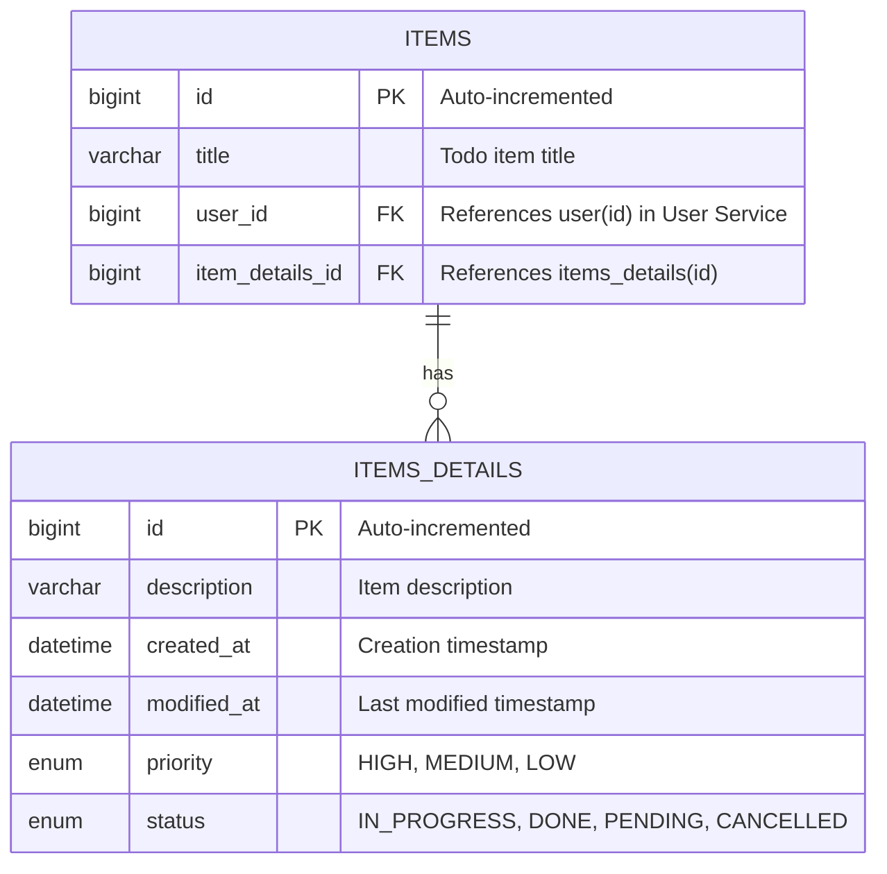

# TO-DO

##  ERD Diagram
The Entity-Relationship Diagram (ERD) for the Todo Service, which includes the `items` and `items_details` tables.

```mermaid
erDiagram
    ITEMS ||--o{ ITEMS_DETAILS : has

    ITEMS {
        bigint id PK "Auto-incremented"
        varchar title "Todo item title"
        bigint user_id FK "References user(id) in User Service"
        bigint item_details_id FK "References items_details(id)"
    }

    ITEMS_DETAILS {
        bigint id PK "Auto-incremented"
        varchar description "Item description"
        datetime created_at "Creation timestamp"
        datetime modified_at "Last modified timestamp"
        enum priority "HIGH, MEDIUM, LOW"
        enum status "IN_PROGRESS, DONE, PENDING, CANCELLED"
    }

```
